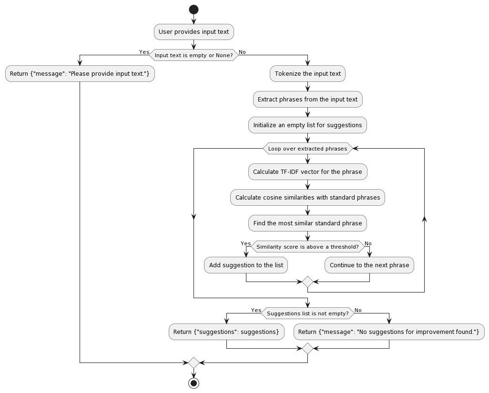
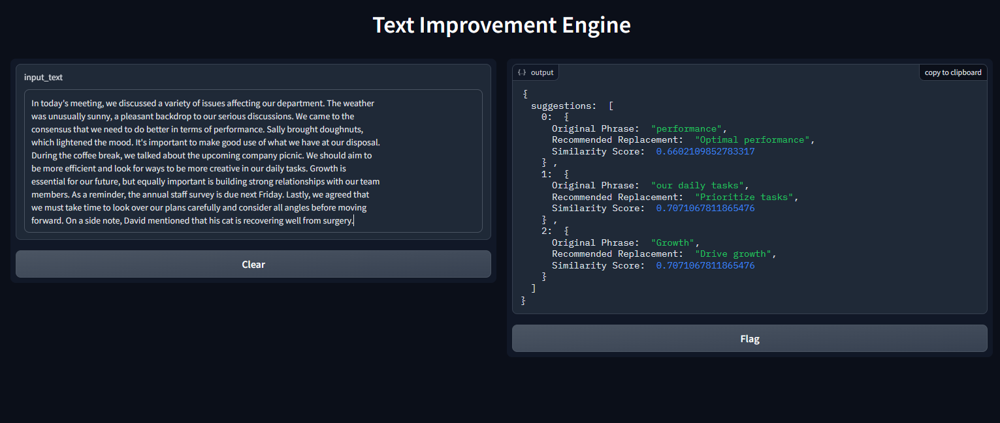

# Text Improvement Engine

## Project Overview

The Text Improvement Engine is a tool that analyzes a given text and suggests improvements based on the similarity to a list of "standardized" phrases. These standardized phrases represent the ideal way certain concepts should be articulated, and the tool recommends changes to align the input text closer to these standards.



## Table of Contents

- [Project Overview](#project-overview)
- [Features](#features)
- [Requirements](#requirements)
- [Setup](#setup)
- [Usage](#usage)
- [License](#license)

## Features

- User-friendly interface for inputting text.
- Semantically analyzes input text using cosine similarity with word embeddings.
- Suggests replacements for phrases in the input text with their more "standard" versions.
- Provides similarity scores for suggested improvements.

## Requirements

- Python (>= 3.6)
- Gradio (>= 3.14.0)
- spaCy (>= 2.3.0)
- scikit-learn (>= 0.23.0)

You can install the required packages using `pip`:

## Setup
Clone this repository to your local machine:
```bash
!git clone https://github.com/imrankh46/search-Engine.git
```

```bash
%cd /content/search-Engine
!pip install -r requirements.txt
!python -m spacy download en_core_web_md
```
Additionally, you need to install spaCy and download the English language model:


Run the Text Improvement Engine using the provided Gradio interface:
```bash
!python text_improvement_engine.py
```
Access the tool through your web browser at the provided URL (e.g., http://localhost:7860).
you can accesses both local and live url.

## Usage
Enter the text you want to analyze into the input text box.
in real time...
The tool will provide a list of suggestions to replace phrases in the input text with their more "standard" versions.
Each suggestion includes the original phrase, the recommended replacement, and the similarity score.



## License

This project is licensed under the MIT License - see the [LICENSE](LICENSE) file for details.

